[TOC]

# 强化学习

**TO KNOW:DQN,DDQN,A2C,A3C,DDPG**，**TRPO**，**PPO**,important sampling，batch normalization，bootstrap,Duel DQN,SVGD

transfer learning、meta-learning、Dyna框架、Ape-X、SAC、GAE

**More DQN**: Rainbow、Ape-X、

**Multi-agent**：MADDPG, COMA, QMIX, QTRAN

## on-policy和off-policy的区别

$$
\begin{array}{l}
Q-learning(off-policy):\mathrm{Q}(\mathrm{s}, \mathrm{a}) \leftarrow \mathrm{Q}(\mathrm{s}, \mathrm{a})+\alpha\left(\mathrm{R}(\mathrm{s})+\gamma \mathrm{max}_{a} \mathrm{Q}\left(\mathrm{s}^{\prime}, \mathrm{a}^{\prime}\right)-\mathrm{Q}(\mathrm{s}, \mathrm{a})\right), \\
Sarsa(on-policy):\mathrm{Q}(\mathrm{s}, \mathrm{a}) \leftarrow \mathrm{Q}(\mathrm{s}, \mathrm{a})+\alpha\left(\mathrm{R}(\mathrm{s})+\gamma \mathrm{Q}\left(\mathrm{s}^{\prime}, \mathrm{a}^{\prime}\right)-\mathrm{Q}(\mathrm{s}, \mathrm{a})\right)
\end{array}
$$

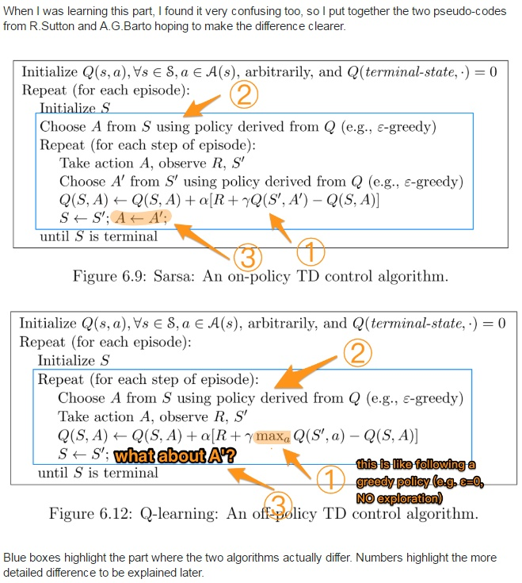

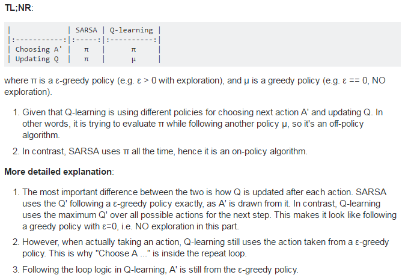


另外基于experience replay的方法基本上都是off-policy的

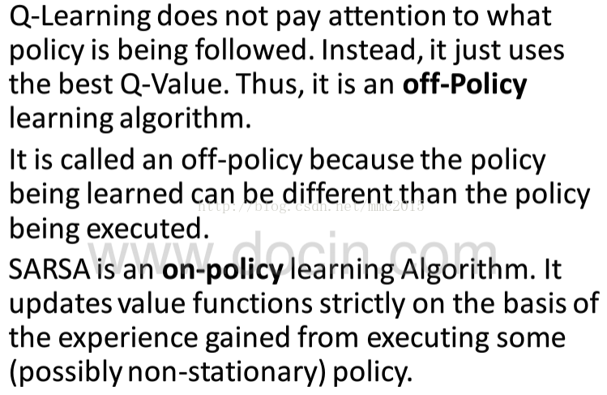

On-policy的目标策略和行为策略是同一个策略，其好处就是简单粗暴，直接利用数据就可以优化其策略，但这样的处理会导致策略其实是在学习一个局部最优，因为On-policy的策略没办法很好地同时保持既探索又利用；而off-policy则将目标策略和行为策略分开，可以在保持探索的同时，更能求到全局最优值。


On-policy methods attempt to evaluate or improve the policy that is used to make decisions. In contrast, off-policy methods evaluate or improve a policy different from that used to generate the data.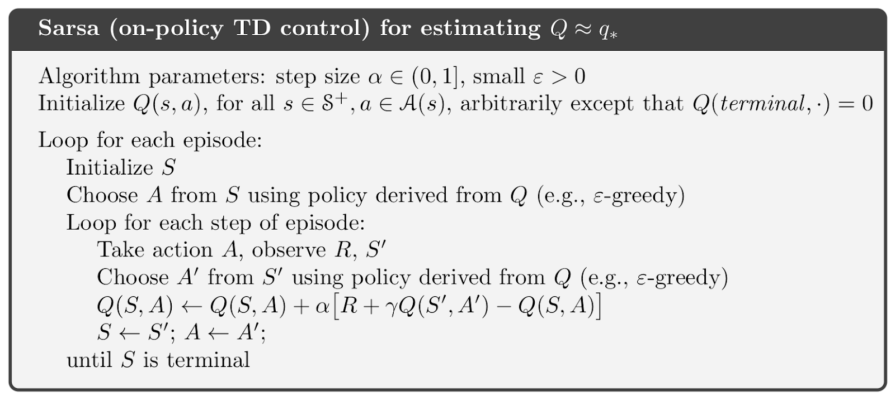

## Model free and Model based RL

## DQN和DDQN

Q-Learning只有一个Q表

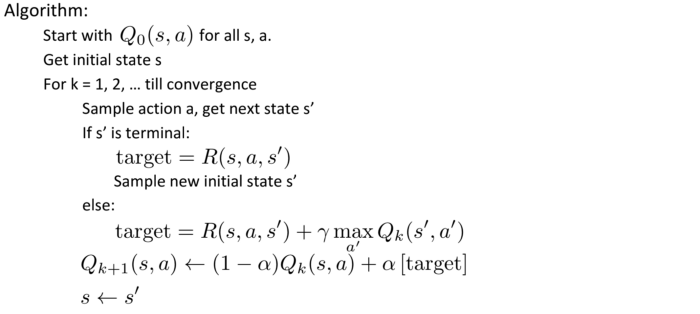

加入神经网络近似，严格来说没有这种算法，介于Q-Learning和DQN之间

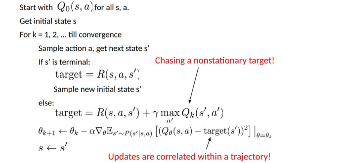


DQN在Q-learning的基础上加入Experience Replay和用神经网络近似以及维持两套参数$\theta_\_$和$\theta$ 

**下面的新网络都是指当前网络，旧网络是指目标网络，评价是指给出某个动作对应的Q值，目标网络延时更新**，**经验池中存储的始终是新网络产生的序列**

**总之，在目标函数中都是使用目标Q网络来给出Q值，而用哪个Q网络来选择目标状态的动作则可能不同**

**老DQN**只有一个Q网络

当前网络选，当前网络评价

**DQN(Nature DQN)**

用旧网络选择目标函数中的最优动作，也用旧网络给出该动作的Q值

容易陷入局部最优

**DOUBLE DQN**

新网络选择目标Q值中的动作，而用旧网络给出该动作的Q值

新网络是指当前网络

**double体现在哪?**

将目标Q值动作的选择和目标Q值动作的评估用不同的值函数来实现

**Soft Q-Learning(SQL)**
$$
\pi_{\text {MaxEnt }}^{*}=\arg \max _{\pi} \sum_{t} \mathbb{E}_{\left(\mathbf{s}_{t}, \mathbf{a}_{t}\right) \sim \rho_{\pi}}\left[r\left(\mathbf{s}_{t}, \mathbf{a}_{t}\right)+\alpha \mathcal{H}\left(\pi\left(\cdot \mid \mathbf{s}_{t}\right)\right)\right]
$$

$$
(s_t,a_t)\sim\rho_\pi
$$

目标策略是旧策略，也是

## SAC

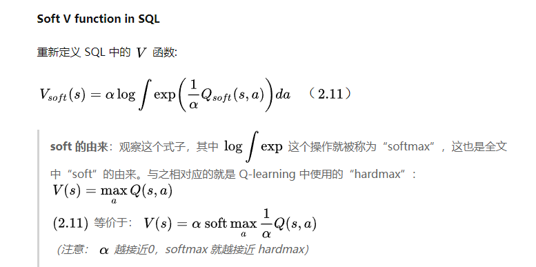

## TD3

TD3全称是**Twin Delayed Deep Deterministic policy gradient**

https://zhuanlan.zhihu.com/p/55307499

在机器学习中广泛存在着bias和variance之间的矛盾，对于Value-Based的方法，在Double Q-learning通过使用两个独立的目标值函数来解耦**更新**和action**选择**操作，以此防止过估计（over estimation）带来的高偏差（bias）。

在Policy gradient系列方法中同样也存在着累计误差带来的高偏差问题，然而Double DQN的做法在Actor-Critic中效果不是很明显。这是因为在连续动作空间中，策略变化缓慢，current Q与target Q变化不大，所以TD3还是沿用Double DQN之前的Double Q-learning的思想，使用两个独立的Critic来防止过估计。同时为了防止高方差（variance），又在其基础上提出了clipped Double Q-learning以及Delayed Policy Updates用于均衡。

TD3直接将两个Critic独立开来，而不是缓慢更新的方式

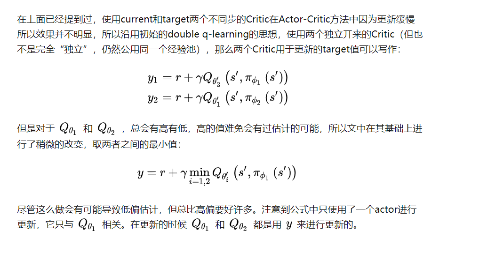

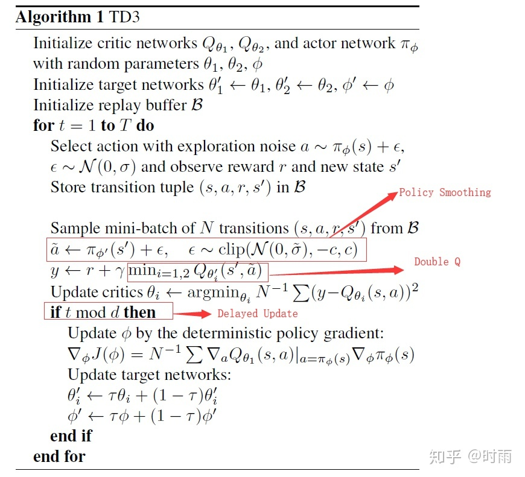


## gae

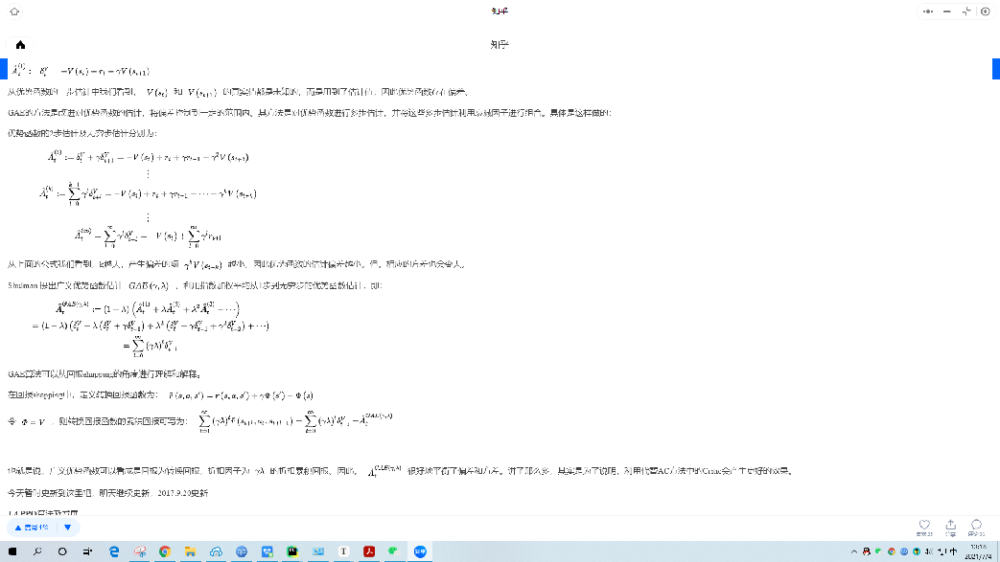

```python
    def compute_gae(next_value, rewards, masks, values):
        values = values + [next_value]
        gae = 0
        returns = []
        for step in reversed(range(len(rewards))):
            delta = rewards[step] + gamma * values[step + 1] * masks[step] - values[step]
            gae = delta + gamma * lam * masks[step] * gae
            # prepend to get correct order back
            returns.insert(0, gae + values[step])
        return returns
```

## AC算法

Actor Critic为on policy算法

没有replay memory

## A3C

A3C相对于AC的改进

1. 分布式

2. 将Actor Critic放到一起

   输入状态S，同时输出状态价值V和策略$\pi$

3. Critic评估点的优化

   优势函数N步采样

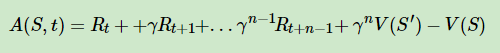

## A2C

引入baseline

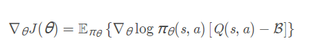


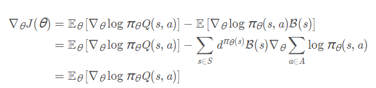

为了使方差更低

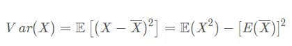


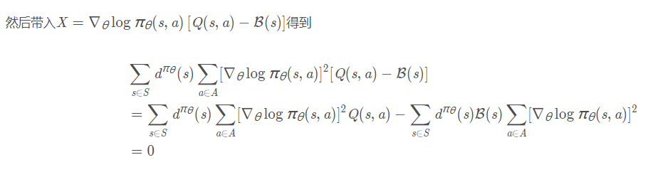


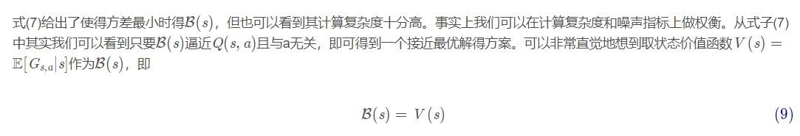

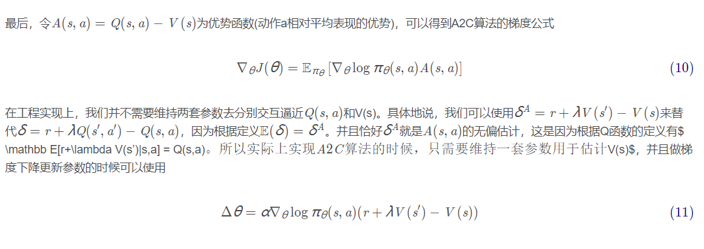

## 为什么DQN、DDQN、DDPG等算法不需要重要性采样

在DQN中，因为动作的生成采用贪婪算法，实际并没有采样

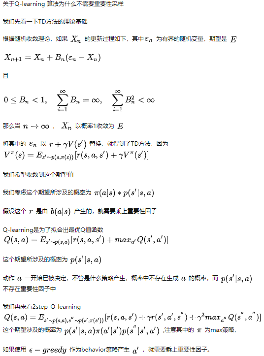

## agent57

## R2D2

## NGU

## RND

## Ape-X DQN

## SAC的target_update_interval

并不是每个timestep都要更新参数

critic_target也不是每次更新梯度都要更新的，这两个都是超参

如，在SAC-v2中

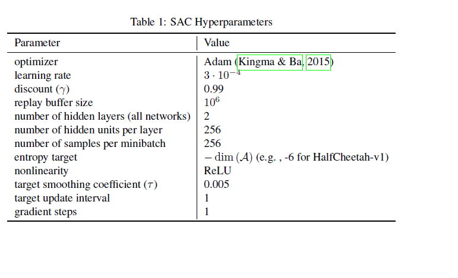

在Discrete SAC中


## 疑问：SAC中的target entropy为什么是-dim(A)

https://zhuanlan.zhihu.com/p/150114190

## Welford's method

https://jonisalonen.com/2013/deriving-welfords-method-for-computing-variance/


http://www.johndcook.com/blog/2008/09/26/comparing-three-methods-of-computing-standard-deviation/

## 贝尔曼操作符

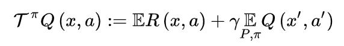

贝尔曼最优算子

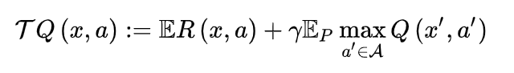

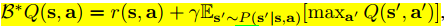

## 值分布强化学习

https://zhuanlan.zhihu.com/p/60632660

https://zhuanlan.zhihu.com/p/337209047

## 温度系数

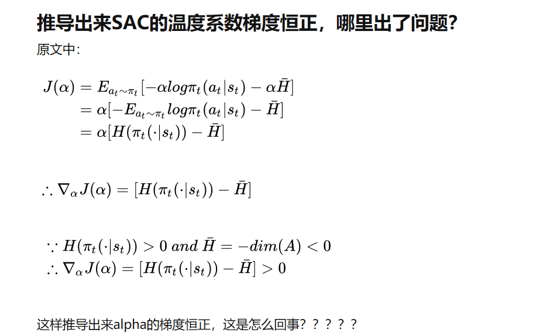


## RL是否要用dropout

可以用，但是rate要足够小，小于0.2

## TD(lambda)和GAE

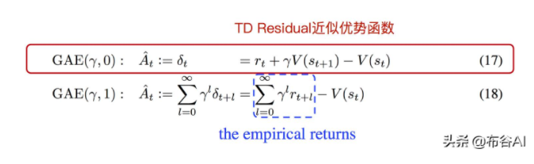


## 共用network


## PPG


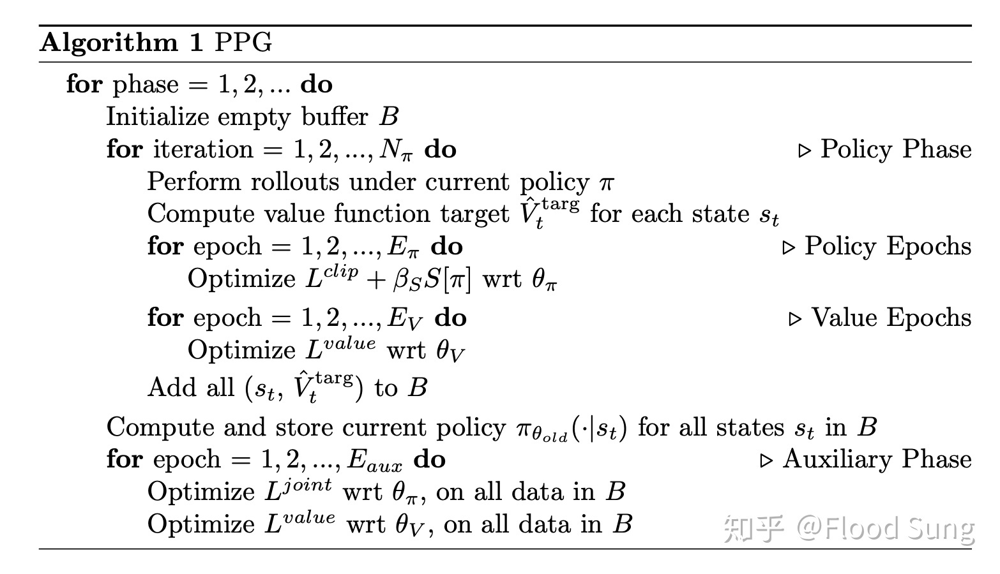

## notes-lms lecture

RL

non-i.i.d data,没有明确的泛化界

## 数据使用效率更高并不意味着学习更快

Q-learning 方法通过搜索  函数间接优化 policy，相对不稳定。Q-learning 的优点是 sample efficient，数据使用效率高。需要注意的是，数据使用效率高并不意味着学习更快，只是说数据可以重复利用，可能需要的计算量更大，时间更长

## Q网络

Deep Q - learning 中用一个神经网络（称为 DQN, Deep Q network）去拟合 Q-Table，实际上是个 Q-value function，即给定了  和  输出相应的 )，可以是 2 输入 1 输出，也可以 1 输入 n 输出，即只输入当前状态，神经网络给出所有可能动作  及其对应的 Q-value，然后采用那个对应最大 Q-value 的动作。

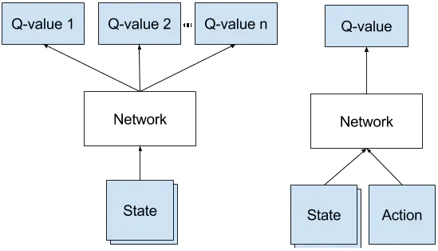

## SAC没有用IS也不是Q-learning体系，为什么也是off-policy算法？

https://www.zhihu.com/question/477605764/answer/2052295060

## 过估计问题

https://zhuanlan.zhihu.com/p/366944494

## transition, trajectory, rollout, vine

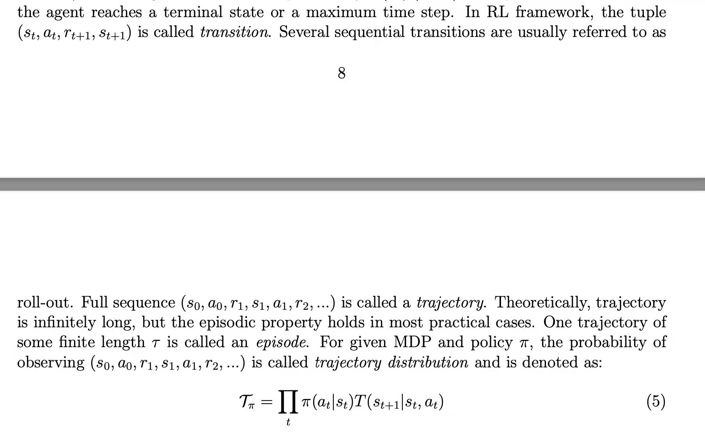


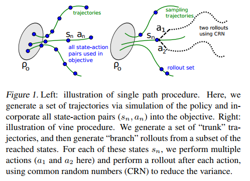

## T和$\frac{1}{1-\gamma}$

这两个通常是对应，分别是finite horizon和infinite horizon，可以互相替换, 见**Bounding the objective value**

## **Bounding the objective value**

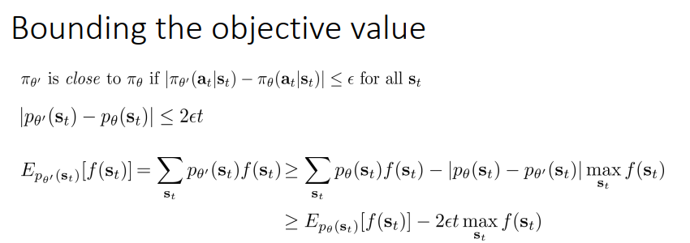

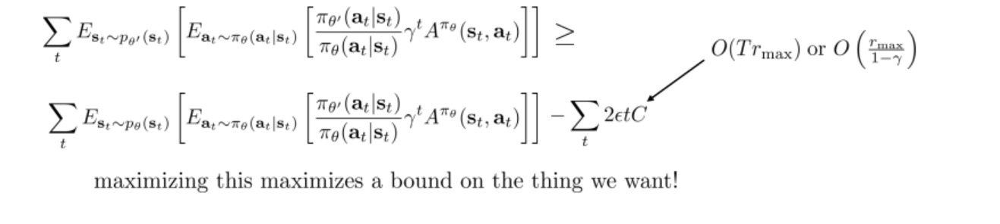

## 为什么PPO不需要重参数化，而SAC却需要

因为PPO不需要对Q(s,a)里的a求梯度，而是通过重要性采样直接利用概率密度进行更新；而SAC通过对Q(s,a)的a求梯度进行更新，没有重要性采样，这也是SAC是off policy的原因。

## LQR, iLQR, DDP

https://blog.csdn.net/weixin_40056577/article/details/104270668

## Safe RL

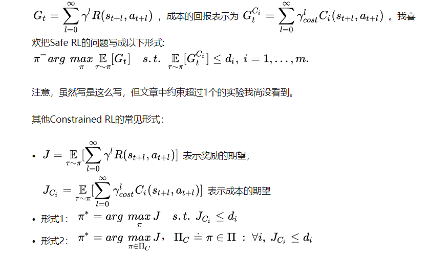

