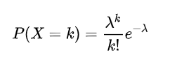
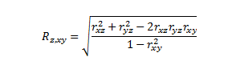
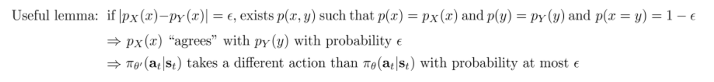

# 数学基础

## 泊松分布

https://blog.csdn.net/ccnt_2012/article/details/81114920

泊松分布是二项分布的极限，将T时间分成n份，每份时间要么发生一件事要么不发生，那么总体发生k次的概率就是泊松分布。

$\lambda$=np是期望值

## beta分布

贝塔分布（Beta Distribution) 是一个作为[伯努利分布](https://baike.baidu.com/item/伯努利分布/7167021)和二项式分布的[共轭先验分布](https://baike.baidu.com/item/共轭先验分布/15696678)的[密度函数](https://baike.baidu.com/item/密度函数/12721265)，在机器学习和[数理统计学](https://baike.baidu.com/item/数理统计学/8763454)中有重要应用。在[概率论](https://baike.baidu.com/item/概率论/829122)中，**贝塔分布**，也称**Β分布，**是指一组定义在(0,1) 区间的连续[概率分布](https://baike.baidu.com/item/概率分布)。

https://www.zhihu.com/question/30269898

## 共轭分布

https://zhuanlan.zhihu.com/p/103854460

## 为什么梯度方向与等高线垂直

https://blog.csdn.net/bitcarmanlee/article/details/85275016

## 三个变量之间的关系

https://www.real-statistics.com/correlation/multiple-correlation/

## Lemmas

