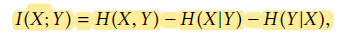
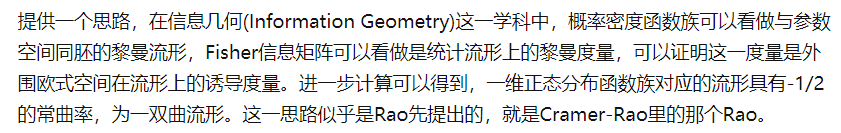

[TOC]

# 机器学习

VC dimension是growth function的上界

VC dimension说明泛化误差越好

经典教材

element of statistic learning

PRML模式识别与机器学习

foundations of machine learning

sutton reinforcement learning

## t-SNE

## 归纳偏置

## [吉布斯采样（Gibbs采样）](https://www.cnblogs.com/emanlee/p/12358194.html)

## MCMC采样

## HMM算法

https://blog.csdn.net/weixin_40056577/article/details/104577050

## 概率图模型(Graphical Model Setting)

## VC Dimension理解

只适用于二元分类

多元分类使用Natarajan dimension

## Rademacher复杂度和VC维

**Rademacher复杂度通过测量假设集对随机噪声的拟合程度来表征函数族的丰富性**

https://blog.csdn.net/bwqiang/article/details/106009059

https://blog.csdn.net/m0_37687753/article/details/81116528

## Mutual Information

见Learning Modality-Invariant Latent Representations for
Generalized Zero-shot Learning

神经网络中mutual Information估计方法,见Mine: mutual information neural estimation

## logistic regression

https://blog.csdn.net/qq_34615112/article/details/105611804

## logistic regression假设样本服从泊松分布

## logistic regression的VC Dimension是多少

## pocket algorithm(PLA的改进版)

## PID、LQR、iLQR、DDP、MPC

https://zhuanlan.zhihu.com/p/91865627

## 吸引子网络

## 神经网络的Lipschitz条件

深度学习中的Lipschitz约束：泛化与生成模型

https://blog.csdn.net/qq_16568205/article/details/99586056

## HMM(Hidden Markov Model)

举例：扔不均衡硬币

## 频率学派和贝叶斯学派

## 维度灾难(The curse of dimensionality)

https://blog.csdn.net/qq_39521554/article/details/80653712

## 线性回归中为何假设样本噪声服从高斯分布

## 拉普拉斯分布

## ELBO

## Fisher信息

https://www.zhihu.com/question/26561604

https://towardsdatascience.com/an-intuitive-look-at-fisher-information-2720c40867d8

Fisher information provides a way to measure the amount of information that a random variable contains about some parameter *θ* (such as the true mean) of the random variable’s assumed probability distribution.

## logistic regression核技巧

## 流形学习

测地距离

ISOMAP

LLE

LE

https://blog.csdn.net/yuanliang861/article/details/85059209

为什么马氏距离只能处理线性流形

## pareto front hypervolume

## hubness problem

Cover定理指出：将复杂的模式分类问题非线性地映射到高维空间将比投影到低维空间更可能线性可分

## 非线性自回归神经网络

https://www.sohu.com/a/233487130_354986

## CBOW、Skip-Gram

## counterfactual reasoning  

## Neural Tangent Kernel

## EM算法

