[TOC]

# Deep Learning

**梯度消失**：主要是指激活函数的导数小于1，例如sigmoid函数，tanh

**梯度爆炸**:相反是指激活函数的梯度大于1

如果激活函数是**sigmoid**就会产生梯度消失，**tanh**也是一样，他们两个的梯度都小于1，而**relu**函数梯度等于1解决了梯度消失问题

elu、Gelu

Instance Segmentation

backbone

head Architecture

支持向量机SVM

损失函数针对单个样本

代价函数针对整个训练集

## RNN

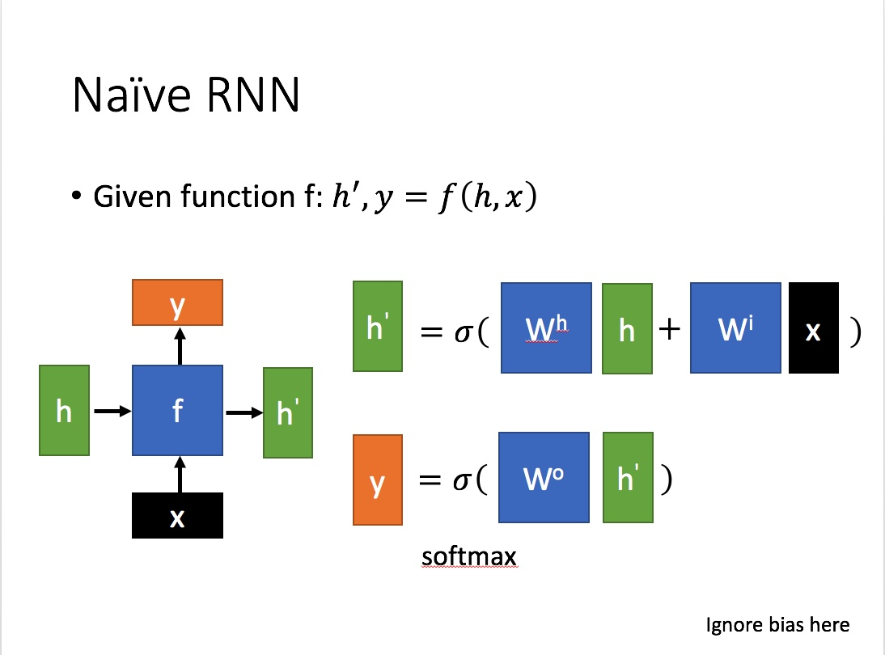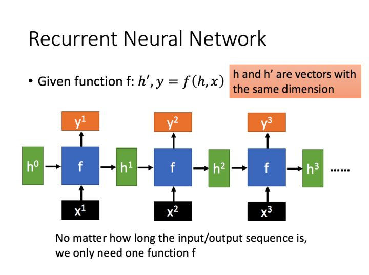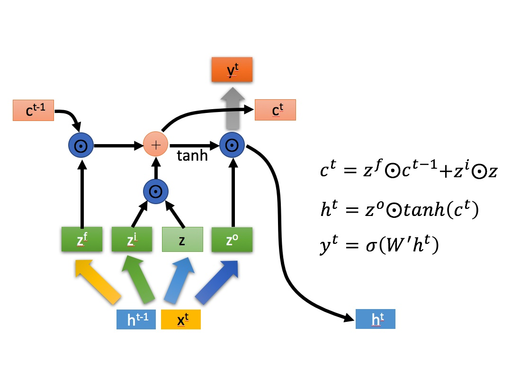

## 反卷积

## 上采样和反卷积

## SE block

## t-SNE

## notes

高维空间数据都是稀疏的

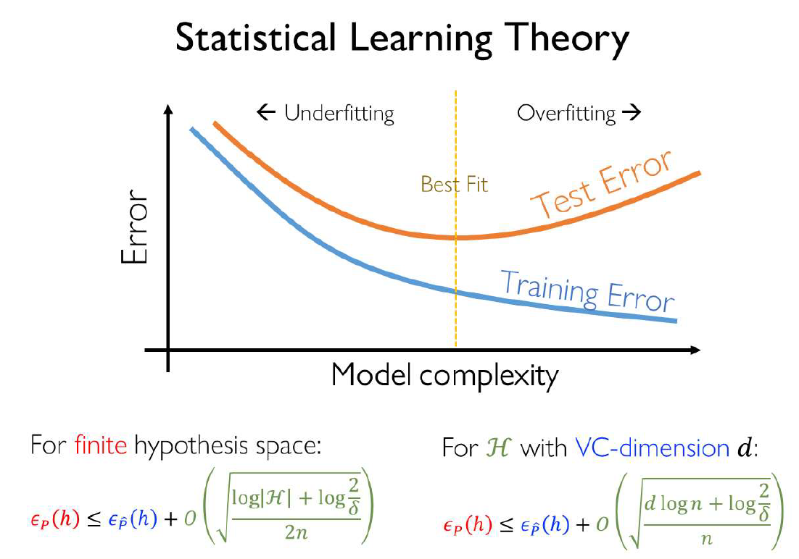

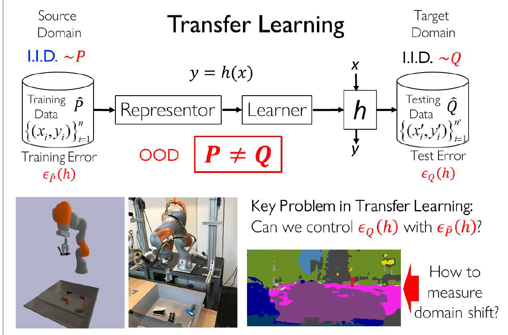

## meta learning

拉普拉斯先验

高斯先验对应L2正则项

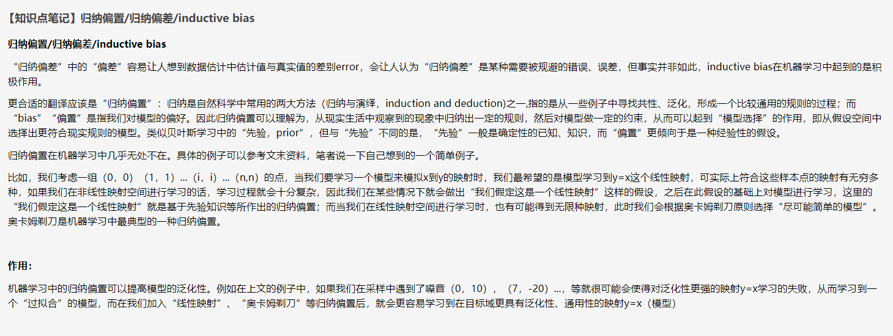

## Welfold Algorithm

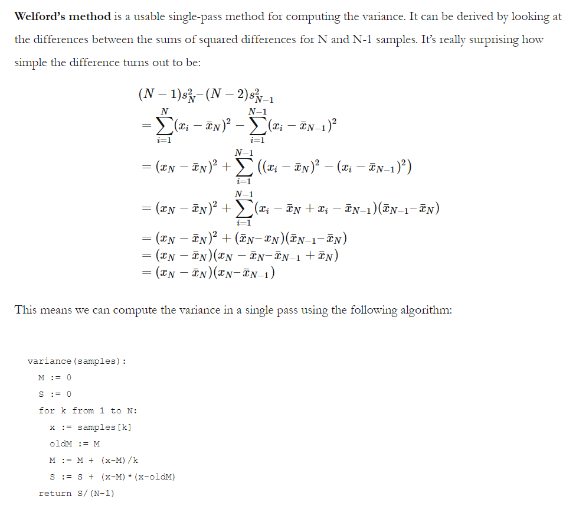

## GMM

## 稀疏自编码器

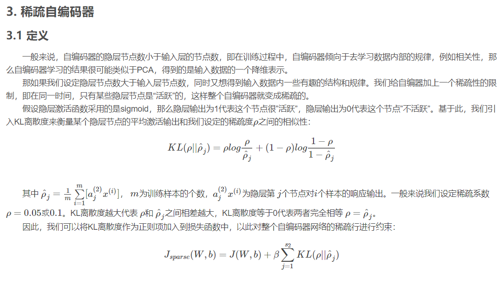

## GAN

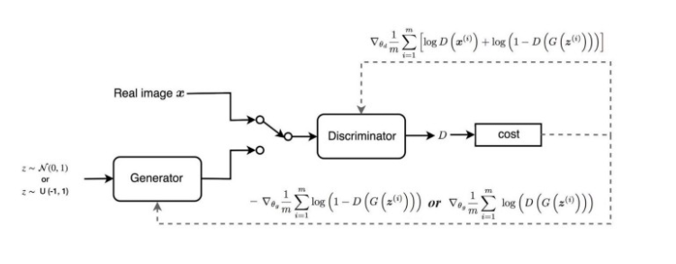

https://jonathan-hui.medium.com/gan-why-it-is-so-hard-to-train-generative-advisory-networks-819a86b3750b

## DCGAN

## WGAN-GP

https://zhuanlan.zhihu.com/p/58260684

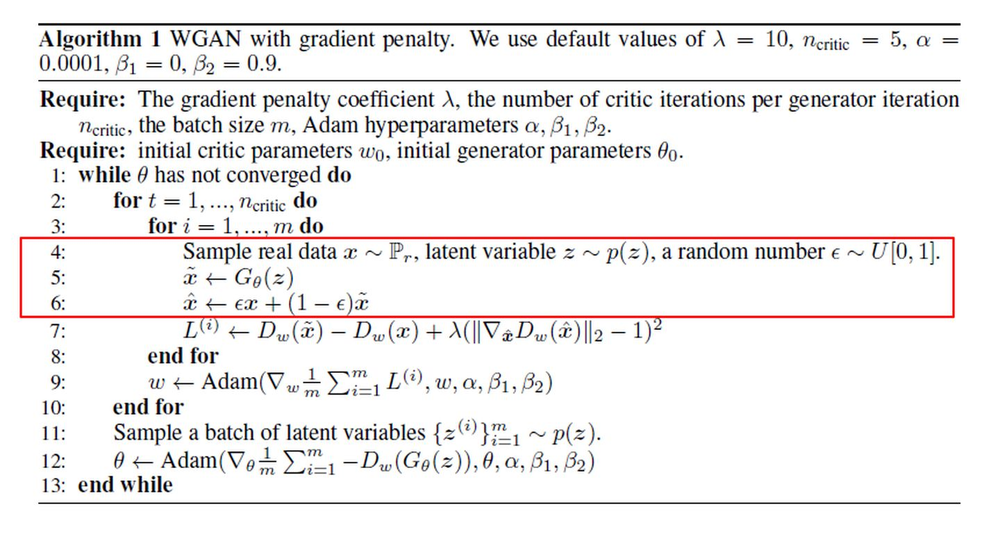

注意，用于计算GP的样本是生成样本和真实样本的线性插值。

## Conditional GAN

https://zhuanlan.zhihu.com/p/86451268

## JS散度

## Hungarian Algorithm

匈牙利算法

https://blog.csdn.net/u011837761/article/details/52058703

## Bilinear CNN

## InfoGAN

## StyleGAN

## VAEGAN

## transformer参数量计算

https://www.jianshu.com/p/677fc8be5e14

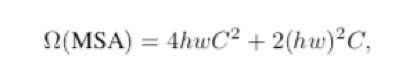

## 为什么self attention要scale

https://blog.csdn.net/weixin_37947156/article/details/100082543

## MLP、CNN、RNN、Transformer处理序列任务

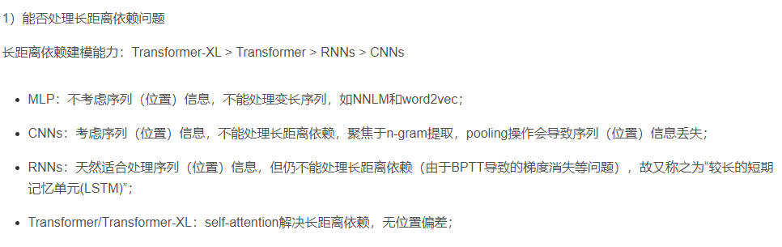

## 自回归和自编码模型

